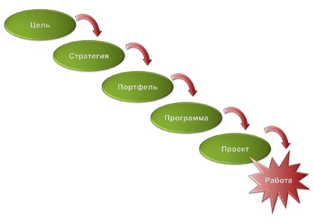
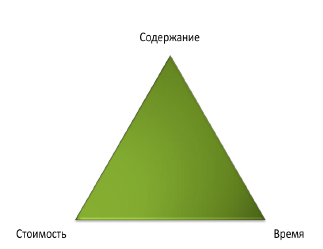
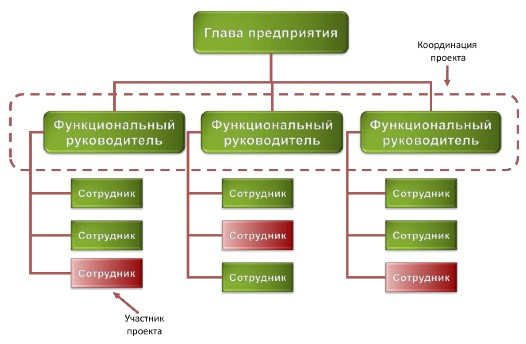
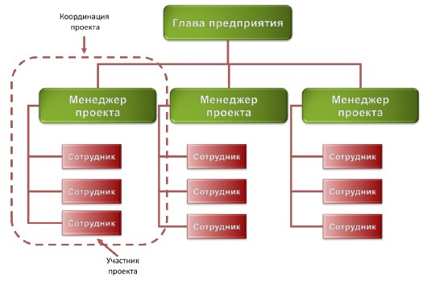
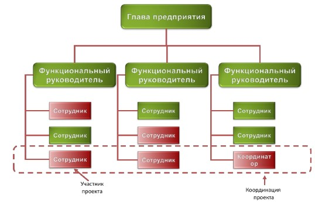
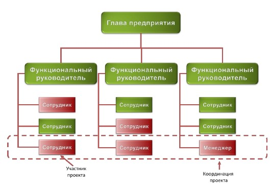
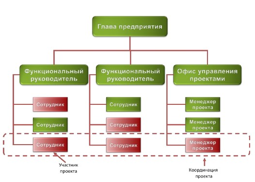

# Вопросы к экзамену по «Управлению проектами»

[1. Определения проекта и проектного управления. Жизненный цикл проекта, процессы жизненного цикла проекта и их категории](#kek-1)
[2. Стадии развития продукта, жизненный цикл продукта. Виды защиты интеллектуальной собственности](#kek-2)
[3. Бизнес-план start-up компании (бизнес-проекта)](#kek-3)
[4. Области знаний необходимые в УП. Отличия программной инженерии от других отраслей. Эволюция подходов к управлению программными проектами](#kek-4)
[5. Модели процесса разработки ПО. Закон четырех «П»](#kek-5)
[6. Действия для успешности программного проект](#kek-6)
[7. Проект — основа стратегического развития компании. Критерии успешности проекта. Железный треугольник](#kek-7)
[8. Проект и организационная структура компании, виды матричного управления](#kek-8)
[9. Организационная структура проектной команды](#kek-9)
[10. Управление приоритетами проектов, определение ценности проекта](#kek-10)
[11. Концепция проекта](#kek-11)
[12. Анализ содержания и состава работ. Декомпозиция и иерархическая структура работ (ИСР). Базовый план проекта](#kek-12)
[13. Общий план проекта, виды проектных планов. Рабочий план проект](#kek-13)
[14. Стадии разработки ПО. Трудоёмкость и сроки выполнения проекта](#kek-14)
[15. Управление рисками проекта](#kek-15)
[16. Управление командой проекта](#kek-16)
[17. Инструменты количественного управления проектом](#kek-17)
[18. Этапы внедрения программного продукта. Итоговая отчетность](#kek-18)

## I. История развития программной инженериии основные понятия.

### 1. Определения проекта и проектного управления. Жизненный цикл проекта, процессы жизненного цикла проекта и их категории.

**Проект** — уникальная деятельность, имеющая начало и конец во времени, направленная на создание заранее определенного нового продукта (услуги, результата) при заданных ограничениях (бюджет, время, ресурсы, требования качества, допустимый уровень риска).

**Управление проектом** — деятельность, использующая способности, специальные инструменты и процессы для достижения поставленной цели, балансируя с ограничениями в рамках конкретного проекта (объемами работ, сроками, ресурсами, качеством, рисками).

**Жизненный цикл проекта**

*Инициация* (Initiation). Идея, концепция.
*Планирование* (Planning). Самое сложное — написать реалистичный план.
*Выполнение* (Execution). Мониторинг и контроль отклонений от плана, его корректирование.
*Закрытие* (Closing). Аналитический отчёт и презентация.

Каждая фаза заканчивается аналитической запиской (ошибки, сложности и т.д.)

**Процессы жизненного цикла**

- *Основные*:
  - Заказ (acquisition).
  - Поставка (supply).
  - Разработка (development).
  - Эксплуатация (operation).
  - Сопровождение (maintenance).
- *Вспомогательные*:
  - Документация (documentation).
  - Управление конфигурацией (configuration management).
  - Качество (QA).
  - Верификация (verification).
  - Аттестация.
  - Анализ (joint analysis).
  - Аудит.
  - Анализ проблем и их решение.
- *Организационные*:
  - Управление (management).
  - Инфраструктура проекта (infrastructure).
  - Усовершенствование проекта (improvement).
  - Обучение (training) (своих специалистов/заказчиков).

### 2. Стадии развития продукта, жизненный цикл продукта. Виды защиты интеллектуальной собственности.

**Стадии развития продукта**

1. *Концепция продукта* — идея с доказанной выполнимостью. Обоснование идеи. Схема, алгоритм, средства выполнения.
2. *Рабочая модель* — реализованная концепция, рабочий макет основного функционала. Демоверсия проекта. Возможность оценить функционал (основной) приложения, например, консольное приложение.
3. *Прототип* — все физические свойства итогового продукта. Например, демонстрационная модель. Что-то может работать с ошибками, но основной функционал работает.
4. *Инженерный прототип* — прототип + технология его производства. Технология может быть на бумаге. Например, альфа-версия ПО.
5. *Предпродажный прототип* — бета-версия, инженерный прототип + дизайн. Есть несколько экземпляров, есть поставщики, имеем опытный образец.
6. *Продукт*.

**Жизненный цикл продукта**

1. *Разработка*.
2. *Изучение рынка*.
3. *Рост*.
4. *Стадия насыщения*.
5. *Уход с рынка*.

Длительности стадий для разных продуктов разные.

**Виды защиты интеллектуальной собственности**

1. *Know-how*. Коммерческая тайна. Документация содержится в секрете.
2. *Торговая марка* (знак).
  - Логотип, бренд, слоган.
  - Средство идентификации продукта.
  - Можно свободно ставить ™ или ®, но защиты это не даёт.
  - Нужно регистрировать торговую марку.
  - Нужно отправить туда образец продукта и доказательство, что продукт продаётся (например, фото полки в магазине).
3. *Copyright* ©. Авторские права. Могут быть переданы кому-либо.
4. *Патент* — решение технической задачи: новое, выполнимое, полезное, отличающееся от других, неочевидное для специалистов в этой области.
  - Не дает права другим производить и продавать на рынке.
  - Необходимо раскрыть в определенной степени идею, которую предлагаете реализовать (~80% идеи).
  - В основном это Utility patents — методы, приборы, т.п.
  - В основном, истекает через 20 лет.
    *Структура патента*:
  - Аннотация (abstract).
  - Обзор всех разработок.
  - Детальное описание продукта (диаграммы, рисунки и текст).
  - Формула патента (claims) — фактически положение, которое вы защищаете.

### 3. Бизнес-план start-up компании (бизнес-проекта).

1. *executive summary*
  - 1-ая страница — аннотация (abstract). Кто что для кого будет производить, краткое описание продукта, расположение офиса (контакты).
  - 2-ая страница.
    - Конкретные цели по годам (3 предложения/абзаца — основные цели, вехи и результаты).
    - Миссия (что вы принесете в мир?).
    - Ключи к успеху (маркетерские ходы), ключ к тому, что ваш продукт будет успешным.
2. *О компании* (company).
  - 2.1. Юридическая организация компании (ООО, инд. предприниматель и пр.)
  - 2.2. Расположение участников (фрилансеры, аутсорс и всё прочее).
  - 2.3. Затраты на старте.
3. *Продукт*.
  - 3.1. В какую категорию попадает ваш продукт.
  - 3.2. Описание продукта.
  - 3.3. Производство, себестоимость.
  - 3.4. Безопасность продукта.
  - 3.5. Планы по развитию.
4. *Маркетинг*.
  - 4.1. Общее описание подобных продуктов на рынке и состояние рынка (например сколько аналогичных товаров такого типа продаётся).
  - 4.2. Сегментация — определяем целевую группу.
  - 4.3. Стратегия, вид рекламы.
  - 4.4. Анализ индустрии.
5. *Продажи*.
  - 5.1. Конкуренты.
  - 5.2. Ценовая политика.
  - 5.3. Каналы продаж.
  - 5.4. Вехи продаж по годам (1 г. — поквартально).
6. *Менеджмент*.
  - 6.1. Владельцы.
  - 6.2. Должности (в том числе вспомогательные, например, бухгалтер).
  - 6.3. Зарплаты (в т.ч. мб оценка роста по годам).
7. *Финансы*.
  - 7.1. Затраты на стартап, кредиты, если взяты.
  - 7.2. Точка безубыточности (когда можно точно работать на собственные средства).

### 4. Области знаний необходимые в УП. Отличия программной инженерии от других отраслей. Эволюция подходов к управлению программными проектами.

**Программная инженерия** (ПИ) — это применение системного и измеримого подхода к разработке, эксплуатации и поддержке.

**Основные области знаний**

1. Программные требования.
2. Проектирование ПО.
3. Разработка ПО.
4. Тестирование ПО.
5. Эксплуатация и поддержка.
6. Конфигурационное управление.
7. Процессы ПИ (состыковывают части).
8. Инструменты и методы (поддерживают современные технологии).
9. Качество ПО.
10. Управление в ПИ.

**Дополнительные области знаний**

1. Разработка hardware.
2. Теоретические основы (Computer Science).
3. Системное проектирование (поддерживает инфраструктуру предприятия).
4. Управление качеством.
5. Управление проектами.
6. Общий менеджмент.

**Отличия программной инженерии от других отраслей**

- Успешные проекты — 35%.
- Неуспешные проекты — 45% (не прошли по срокам/средствам).
- Провальные проекты — 20% (были закрыты до выпуска).

- Виноват менеджмент. Все проблемы должны быть решены на этапе препроектной подготовки.
- Разработка ПО ближе к НИР. Это проект в нематериальной сфере.

**Эволюция подходов к управлению программными проектами**

- «Как получится». Разомкнутая система управления. Полное доверие техническим лидерам. Представители бизнеса практически не участвуют в проекте. Планирование, если оно и есть, то неформальное и словесное. Время и бюджет, как правило, не контролируются.
- «Водопад» или каскадная модель. Жесткое управление с обратной связью. Расчет опорной траектории (план проекта), измерение отклонений, коррекция и возврат на опорную траекторию. Лучше, но не эффективно.
- «Гибкое управление». Расчет опорной траектории, измерение отклонений, расчет новой попадающей траектории и коррекция для выхода на нее. «Планы — ничто, планирование — всё».
- «Метод частых поставок». Самонаведение. Расчет опорной траектории, измерение отклонений, уточнение цели, расчёт новой попадающей траектории и коррекция для выхода на нее.

### 5. Модели процесса разработки ПО. Закон четырех «П».

**Модель** (методология) — система принципов, понятий, методов, способов и средств, определяющие стиль разработки ПО. Их классифицируют по **весу** — количеству формализованных процессов.

Выбор методологии зависит:
- От самого проекта.
- От размера и профессионализма команды.
- Стабильность и зрелость процессов компании.

**Модели процесса разработки ПО**

0. *«Как получится»*.
1. *«Водопад» или каскадная модель* — жёсткое управление с обратной связью.
  - Следование чёткому регламенту.
  - Нельзя откатиться назад.
  - Обязательна документация.
  - Каскады обеспечивают безопасность.
  - Для военных, секретных производств и защищённых объектов.
2. *Software Capability Mature Model* (SWCMM). Имеет уровни:
  - 2.1. Начальный — когда определены немногие процессы и успех во многом зависит от конкретных исполнителей.
  - 2.2. Повторяемый — срок, бюджет и функциональность.
  - 2.3. Определённый — когда повторяемые процессы объединены в общую систему компании.
  - 2.4. Управляемый — когда не просто используем систему, но и анализируем статистику по использованию.
  - 2.5. Оптимизируемый — когда стараемся оптимизировать процессы.
3. *RUP* (Rational Unifed Process) — универсальная система $\Rightarrow$ можно работать и по гибкой системе, и по водопадной.
4. *Microsoft Solution Framework* — использует итеративную модель разработки, меньше бюрократии.
5. *Институт ПИ* (PSP/TSP) — определяет требования/компетенции.
  - *PSP*.
    - (1) Программист должен уметь оценивать объем задачи.
    - (2) Разбивать на подзадачи.
    - (3) Распределить задачи по времени и последовательности.
    - (4) Выполнять сверху собственные разработки с движением архитектуры проекта (движение синхронно с общей архитектурой, на совещаниях и пр.)
    - (5) Индивидуальная проверка кода.
    - (6) Регрессивное тестирование.
    - (7) Учитывать найденные дефекты (помечать их).
    - (8) Классифицировать найденные дефекты.
    - (9) Описывать результат тестирования.
    - (10) Учитывать своё время на разработку.
  - *TSP*.
    - (1) Команда должна иметь четкие цели.
    - (2) Четкий план и процессы взаимодействия.
    - (3) Отслеживать выполнение работы.
    - (4) Максимальная мотивация и производительность.
6. *Гибкие модели*.
  - Процесс долбжен быть адаптивным в управлении и ориентирован на управление людьми.
  - 4 важных пункта:
    - (1) Интерактивонсть.
    - (2) Инкрементальность.
    - (3) Самоуправляемость команды.
    - (4) Адаптивность.
  - Пример — SCRUM.

**SCRUM** (Основывается на эмпирическом подходе — знание «как управлять» приходит с опытом), для управления надо понимать три принципа:
1. Прозрачность — значимые аспекты и результаты процесса разработки должны быть доступны, все участники должны видеть как движется команда (у всех одинаковая картина перед глазами).
2. Инспекция — выявление нежелательных отклонений от плана.
3. Адаптация — если находим отклонения от плана, то мы их корректируем.

**Спринт** — подпроект большого проекта (обычно не больше месяца), каждый такой спринт обеспечивать инкрементальность разработки.

*Важно*: процессы планирования спринта, процессы мониторинга отклонения от плана, разработка и обзор всего спринта с ретроспективой.
1. Продолжительность спринта короткая
2. Принятый план спринта не подлежит никакому изменению

**Scrum-команда** — аналог руководителя продукта, состоит из руководителя проекта, scrum-master (руководитель проекта на спринт), команда разработки.

В обязанности скрам-мастера входят организация проведение и подведение результатов ежедневных рабочих встреч.

Каждый на летучке говорит, что сделал с момента предыдущей встречи, что делает сегодня и какие видятся проблемы.

**Отмена спринта** — если вдруг есть неразрешимая проблема (например, изменение условий рынка, заказчика, технологий), то он отменяется владельцем продукта.

**Закон четырёх «П»**

1. Сам проект.
  - По масштабу.
    - Малые (< 6 месяцев, до 50 чел. мес.)
    - Средние (от 6 до 12 месяцев, 50-100 чел. мес.)
    - Крупные (> 1 года, > 100 чел. мес.),
  - Трудоёмкость (человекомесяцы).
2. Сам продукт. 
   Сложность продукта, его риски.
3. Персонал.
  - Уровень профессионализма проектной команды.
  - Эффективность коммуникаций.
  - Мотивация команды.
  - Сплочённость и стабильность команды.

4. Процесс (зависит от персонала, продукта и проекта)
  - У каждого проекта должна быть своя модель процесса разработки.
  - У каждой модели — свое время.
  > Это означает, что не существует единственного правильного процесса разработки ПО, в каждом новом проекте процесс должен определяться каждый раз заново, в зависимости от проекта, продукта и персонала, в соответствие с «Законом 4-х П». Совершенно разные процессы должны применяться в проектах, в которых участвуют 5 человек, и в проектах, в которых участвуют 500 человек. Если продуктом проекта является критическое ПО, например, система управления атомной электростанцией, то процесс разработки должен сильно отличаться от разработки, например, сайта. И, наконец, по-разному следует организовывать процесс разработки в команде вчерашних студентов и в команде состоявшихся профессионалов.

### 6. Действия для успешности программного проекта

> Чек-лист из 33-ех пунктов от Стива Макконела

Чтобы программный проект стал успешным, необходимо:

1. Четко ставить цели.
2. Определять способ достижения целей.
3. Создавать команду.
4. Контролировать и управлять реализацией.
5. Анализировать угрозы и противодействовать им.

1. **Ставим цели**
   1. Концепция определяет ясные цели
   2. Все члены команды считают концепцию реалистичной
   3. У проекта есть технико-экономическое обоснование
   4. Д.б. разработан прототип пользовательского интерфейса
   5. Разработана спецификация целевых функций продукта
   6. С конечными пользователями установлена обратная связь
2. **Определяем способ достижения целей**
   7. У проекта д.б. общий и детальный план разработки
   8. В плане проекта прописаны второстепенные задачи (упр. конфигурациями, и т.д.)
   9. Обновление рабочего плана после каждой вехи
   10. Документация архитектуры и проектных решений
   11. План обеспечения качества (по тестированию, аудиту, лицензированию и т.д.)
   12. План многоэтапной поставки продукта
   13. Учёт административной составляющей (количества рабочих дней, отпуска, больничные и пр) 
   14. План одобрен всеми участниками
3. **Команда**
   15. Опыт команды достаточен для выполнения проекта 
   16. У команды достаточная компетенция
   17. Есть технический лидер команды
   18. Численность команды (оценка зп и пр.)
   19. Сплоченность команды
   20. Приверженность проекту (процент занятости в вашем проекте)
4. **Контролируем и управляем реализацией**
   21. У проекта есть только один руководитель
   22. У проекта есть куратор (обычно топ-менеджер)
   23. По каждому компоненту есть веха (или несколько)
   24. Информирование команды и заинтересованных сторон о проекте (не выдавать внутреннюю кухню заказчику)
   25. Доверительные отношения в команде
   26. Установлена процедура управления изменениями в проекте
   27. Есть лицо, ответственное за изменения
   28. До проектной команды надо доводить информацию о плане, графике выполнения этого плана и любую статусную инфу по проекту (не доносить инфу, которая может демотивировать)
   29. Автоматическое рецензирование кода (д.б. отрефакторен)
   30. Система багтрекинга
5. **Риски проекта**
   31. Есть список рисков, проводится регулярный анализ
   32. Отслеживание возникновения новых рисков и их внесение
   33. Если есть аутсорс, то определено ответственное лицо для взаимодействия с каждым подрядчиком (2 балла).

### 7. Проект — основа стратегического развития компании. Критерии успешности проекта. Железный треугольник.

**Проект** — это средство стратегического развития. Проекты объединяются в программы.

**Программа** — ряд связанных друг с другом проектов, управление которыми координируется для достижения преимуществ и степени управляемости, недоступных при управлении ими по отдельности.
Проекты и программы объединяются в портфели.

**Портфель** — набор проектов или программ и других работ, объединенных вместе с целью эффективного управления данными работами для достижения стратегических целей.

**Стратегия** — констатация того, каким образом мы собираемся эти цели достигать. 

**Цель** — описание того, что мы хотим достичь.

Проекты преобразуют стратегии в действия, а цели в реальность. Таким образом, каждая работа, которую выполняет конкретный сотрудник, привязывается к достижению стратегических целей организации.

Мы живем в эпоху *перемен* (Практика должна постоянно перестраиваться применительно к новым и новым условиям), *глобализации* (Бизнес идет туда, где дешевле рабочая сила. Интернет) и *интеллектуального капитала* (Идею богатства теперь связывают не с деньгами, а с людьми, не с финансовым капиталом, а с «человеческим»).

Проект это основа инноваций. Сделать то, до чего другие компании еще не додумались, сделать это как можно быстрее, иначе это сделают другие. Предложить потребителю более качественный продукт или такой продукт, потребность в котором потребитель даже не может пока осознать.

**Железный треугольник: Содержание, стоимость, время (требования продуктов, ресурсы, сроки)**

Задача проекта — достижение конкретной бизнес-цели, при соблюдении ограничений «железного треугольника». Это означает, что ни один из углов треугольника не может быть изменен без оказания влияния на другие. 
> **Например** 
>Чтобы уменьшить время, потребуется увеличить стоимость и/или сократить содержание.

**Критерии успешности проекта**
Проект считается успешным, если удовлетворены все требования заказчика и участников проекта. Поэтому у проекта разработки ПО сегодня не три, а четыре фактора успеха:
1.  Выполнен в соответствие со спецификациями.
2.  Выполнен в срок.
3.  Выполнен в пределах бюджета.
4.  Каждый участник команды уходил с работы в 18:00 с чувством успеха (Для успешного проекта характерно постоянное ощущение его участниками чувства удовлетворения и гордости за результаты своей работы, чувства оптимизма).

### 8. Проект и организационная структура компании, виды матричного управления.

Организационная структура компании отражает ее внутреннее устройство, потоки управляющих воздействий, распределение труда и специфические особенности производства. 

*Функциональная (иерархическая)* и *проектная организации* — противоположные полюса, а *матричная организация* — промежуточные состояния.

**Функциональная (иерархическая) структура**

*Функциональная структура имеет следующие особенности:*
  - Сохраняется принцип единоначалия
  - Понятные и стабильные условия работы
  - Хорошо приспособлены для операционной деятельности.
  - Специализация подразделений позволяет накапливать экспертизу.
  - Затруднено принятие решений и коммуникации между исполнителями. Осуществляются только через руководство.
  - Управление сконцентрировано и держится на компетенции высшего руководства
  - Как правило, неэффективен контроль за ходом проекта (нет целостной картины)

Функциональная структура предполагает многоуровневую иерархию. 
Руководители функциональных подразделений - это начальники управлений, начальники подчиненных им служб, отделов, лабораторий, секторов, групп. 
А еще у каждого начальника есть заместитель и, порой, не один. 

> *Примеры:* министерства, ведомства, научные институты и предприятия советского периода.

**Проектная структура**

*В чисто проектных организациях:*
  - Проект организуется как самостоятельное производственное подразделение.
  - Персонал на проект набирается по временным контрактам.
  - После завершения проекта персонал увольняется.
  - Медленный старт.
  - Опыт не аккумулируется.
  - Команды не сохраняются.

Проектные организации не самые эффективные, но порой единственно возможные для выполнения проектов, которые физически удалённы от исполняющей организации. 

> *Например:* строительство нового нефтепровода.

**Матрицы**

В разработке ПО наиболее распространена матричная организация. 

Различают три вида матричной организационной структуры: *слабая, сбалансированная и сильная*.

Одной из особенностей матричных структур является то, что они становятся «плоскими», исчезает многоступенчатая иерархия.

Предприятие, как правило, делится на функциональные отделы, в которых работают специалисты разных категорий, напрямую подчиняющиеся начальнику отдела. 

В матричных структурах роль начальника функционального подразделения в производственном процессе заметно снижается, по сравнению с функциональными структурами. В его компетенции остаются вопросы стратегического развития функционального направления, планирование и развитие карьеры сотрудников, вопросы материально-технического обеспечения работ.

**Слабая Матрица**

В слабой матрице роль и полномочия сотрудника, который координирует проект, сильно ограничены. Реальное руководство проектом осуществляет один из функциональных руководителей.

**Сбалансированная матрица**

Сбалансированная матрица характеризуется тем, что появляется менеджер проекта, который реально управляет выделенными на проект ресурсами. Он планирует работы, распределяет задачи среди исполнителей, контролирует сроки и результаты, несет полную ответственность за достижение целей проекта, при соблюдении ограничений.

В сбалансированных матрицах наиболее ярко проявляется проблема двойного подчинения. Руководитель функционального подразделения и менеджер проекта имеют примерно равное влияние на материальный и профессиональный рост разработчиков.

**Сильная матрица**

В сильной матрице менеджеры проектов объединяются в самостоятельное функциональное подразделение — офис управления проектами (ОУП). ОУП разрабатывает корпоративные политики и стандарты в области проектного управления, планирует и осуществляет профессиональное развитие менеджеров.

### 9. Организационная структура проектной команды.

**Категории специалистов**

1.  *Группа анализа*
  - Бизнес-аналитик. Построение модели предметной области (онтологии).
  - Бизнес-архитектор. Разрабатывает бизнес-концепцию системы. Определяет общее видение продукта, его интерфейсы, поведение и ограничения.
  - Системный аналитик. Отвечает за перевод требований к продукту в функциональные требования к ПО.
  - Специалист по требованиям. Документирование и сопровождение требований к продукту.
  - Менеджер продукта (функциональный заказчик). Представляет в проекте интересы пользователей продукта, формулирует требования к продукту.
2.  *Группа управления*
  - Руководитель проекта. Отвечает за достижение целей проекта при заданных ограничениях (по срокам, бюджету и содержанию), осуществляет операционное управление проектом и выделенными ресурсами.
  - Куратор проекта. Оценка планов и исполнения проекта. Выделение ресурсов.
  - Системный архитектор. Разработка технической концепции системы. Принятие ключевых проектных решений относительно внутреннего устройства программной системы и её технических интерфейсов.
  - Руководитель группы тестирования. Определение целей и стратегии тестирования, управление тестированием.
  - Ответственный за управление изменениями, конфигурациями, за сборку и поставку программного продукта.
3.  *Группа разработки*
  - Проектировщик. Проектирование компонентов и подсистем в соответствие с общей архитектурой, разработка архитектурно значимых модулей.
  - Проектировщик базы данных.
  - Проектировщик интерфейса пользователя.
  - Разработчик. Проектирование, реализация и отладка отдельных модулей системы.

  В большом проекте может быть несколько производственных групп.
4.  *Группа тестирования*
  - Проектировщик тестов. Разработка тестовых сценариев.
  - Разработчик автоматизированных тестов.
  - Тестирование документации.
  - White-box testing – тестировщик имеет доступ к исходному коду. Анализ кода на ошибки, они правят код.
  - Black-box testing – не имеют. Тестирование, анализ результатов, документирование результатов.
  - Специалист по наукоемкому тестированию – обнаружение алгоритма на уровне алгоритма.
5.  *Группа обеспечения*
  - Технический писатель.
  - Переводчик.
  - Дизайнер графического интерфейса.
  - Разработчик учебных курсов, тренер.
  - Участник рецензирования (аудитор/рецензирует).
  - Системный администратор.
  - Технолог.
  - Специалист по инструментальным средствам.
  - Продажи и маркетинг.
  - Другие.

**Возможны следующие совмещения ролей**
  - Руководитель проекта + системный аналитик (+ системный архитектор)
  - Системный архитектор + разработчик
  - Системный аналитик + проектировщик тестов (+ технический писатель)
  - Системный аналитик + проектировщик интерфейса пользователя
  - Ответственный за управление конфигурациями + ответственный за сборку и поставку (+ разработчик)

**Крайне нежелательно совмещать следующие роли**
  - Разработчик + руководитель проекта
  - Разработчик + системный аналитик.
  - Разработчик + проектировщик интерфейсов пользователя.
  - Разработчик + тестировщик (НИКОГДА).

## II. Фазы проекта. Инициация проекта.

### 10. Управление приоритетами проектов, определение ценности проекта.

**Оценки**

1. *Финансовая ценность*. Окупаемость.
  - Высокая — окупаемость до года, доход превышает их в 1.5 раза.
  - Средняя — 1-3 года, 25%.
  - Низкая — внутренние проекты.
  - Шкала привлекательности (0-3).
2. *Стратегическая ценность*.
  - Высокая — обеспечивает стратегическое преимущество на рынке (3 балла).
  - Средняя — временное конкурентное преимущество (до года), выполнение обязательств для заказчиков.
  - Низкая — поддержание репутации компании.
3. *Уровень рисков*.
  - Низкий — когда цели и требования предельно понятны и документированы, определены четко масштаб и рамки проекта, доступны ресурсы нужной квалификации в полном объеме и когда не требуется новых технологий или платформ.
  - Средний — есть размытость по требованиям, ресурсы доступны в основном, новая платформа.
  - Высокий — плохо с требованиями, мало ясности.

Какая-то формула: $ P = F + S + (4 - R) $.
// Белых предлагает $ \frac{(F + S)}{R} $

### 11. Концепция проекта.

Концепция проекта является достаточным документом для открытия проекта. Является основной плана. Без неё нельзя открыть проект. Сначала одобряется куратором проекта, а потом — директором. По сути, это *дорожная карта*.

**(\*)** Концепция отвечает на вопросы «кто?» и «зачем делает?».

Состав:
1. *Название*. Может быть длинным, должно отображать ответы на вопросы **(\*)**. Должны быть ключевые слова.
    *Рабочее название* — краткое имя проекта (обычно 1 слово) для внутренних обсуждений. 
2. *Ценность*. По 1-2 предложению на каждый пункт:
  - (1) Финонсовая.
  - (2) Стратегическая.
  - (3) Риски (обосновать можно в п. 11).
3. *Цели и задачи*.
  - Зачем нужен проект, описываем бизнес-цели и соответствующие задачи у заказчика.
  - Цель должна быть значимой, конкретной и реальной.
  - Названия задач могут быть отождествлены с названиями основных компонент продукта (по функционалу).
4. *Ожидаемые результаты*. В двух категориях:
  - (1) Что станет лучше после выпуска продукта?
  - (2) Конкретные результаты продукта.
5. *Технико-экономическое обоснование* (обоснование полезности).
  - В чём была проблема у заказчика и как наш продукт её решает.
  - Что полезного для производителя (нас).
  - Технико-экономическое обоснование (ТЭО) обычно пишется вместе с заказчиком.
6. *Допущения и ограничения*.
  - Обычно связан с п. 11.
  - Этим пытаемся сделать так, чтобы риски были минимальны.
    Пример: указываем платформу и технологии/методы, которые используем для разработки.
  - Продукт может быть стандартизирован — тоже ограничение.
  - предусмотрение изменение в лицензиях (например, была бесплатной, а станет платной).
  - требования безопасности и пр.
7. *Ключевые участники* (заинтересованные стороны).
  - все заинтересованные, кроме команды:
    - (1) спонсор;
    - (2) заказчик;
    - (3) пользователи;
    - (4) куратор, руководитель проекта;
    - (5) внешние соисполнители.
8. *Ресурсы проекта*.
  - В первую очередь — команда.
  - Количество и квалификация персонала.
  - Виды ресурсов:
    - (1) Людские.
    - (2) Материальные.
    - (3) Нематериальные — лицензии, разрешения.
    - (4) Финансовые — бюджет проекта.
    - Трудоёмкость проекта (в чел. мес.)
      На стадии инициации может быть допущена ошибка до 50%. Закон Б. Боэма:
      $ T = 2.5 \sqrt[3]{N} $,
      где $N$ — трудоёмкость, $T$ — время.
      100%:
        - Управление — 10%.
        - Аналитика (10%) + Проектирование (15%) = 25%.
        - Разработка (30%) + Тестирование (20%) = 50%.
        - Документирование — 5%.
        - Конфигурирование — 10%.
    - Сроки проектов программистов обычно — 0.5-1 год.
    - Средний проект — 50-100 чел. мес.
9. *Сроки*.
  - Нужно указать даты начала и окончания проекта и его продолжительность $\Rightarrow$ трудоёмкость.
    **!** Не все сотрудники работают всё время проекта.
  - Указать даты вех проекта.
10. *Критерии приемки*.
  - Это численные значения каких-то показателей.
    Пример: количество пользователей одновременно, число запросов в секунду, время поиска, время выполнения запроса, степень защиты от взлома и т.д.
11. *Риски*.
  - Раскрываем описанный в п. 2.3 уровень рисков.
  - Указать список рисков и оценить их уровни.

>  **Пример**
>  
>  Внутренний проект
>  - Ценность: разбалловка 1-1-3.
>  - Цель проекта — повышение эффективности отдела $X$.
>  - Задачи — снижение затрат и сроков на обработку заявок, повышение оперативности доступа к базе и пр.
>  - Ожидаемые результаты (функционал) — базовое по, документация, обучение юзеров, 
>  ТЭО — улучшение показателей, что было-что стало, например, ещё оптимизация персонала и пр.
>  - Допущения и ограничения — те технологические платформы, которые предусматриваются в проекте, методы, лицензии, сертификаты, нормативные, законодательные акты (например, акты по безопасности).
>  - Участники и заинтересованные люди — все кроме команды: заказчик проекта, спонсор проекта, потребитель; заинтересованные: куратор проекта, руководитель проекта.
>  - Ресурсы — материальные (столы, компы, книги и пр), нематериальные (софт, лицензии), бюджет, люди (трудоемкость — человекочасы, человекомесяцы, сколько отработает, сколько заплатим $\to$ бюджет).
>    // разработка занимает 25-35% времени проекта, длительность $ = 2.5 N^{1/3} $.
>  - Сроки — начало проекта, конец проекта, обосновать, указать вехи разработки.
>  - Критерии приёмки — требования рынка/заказчика, количественные оценки.
>  - Риски — какие риски видно на этапе разработки.

## III. Планирование проекта.

### 12. Анализ содержания и состава работ. Декомпозиция и иерархическая структура работ (ИСР). Базовый план проекта.

**Декомпозиция и иерархическая структура работ (ИСР)**

Иерархическая структура работ (ИСР или WBS — Work Breakdown Structure) — декомпозиция сложной задачи. 

ИСР делит проект на подпроекты, пакеты работ, подпакеты. Каждый следующий уровень декомпозиции обеспечивает последовательную детализацию содержания проекта, что позволяет производить оценку сроков и объемов работ. *ИСР должна включать все промежуточные и конечные продукты*. Можно 3-4 уровня вложенности, но:

1. Каждая вложенная задача должна мочь быть назначена конкретному исполнителю
2. Длительность задач не должна превышать 2-х недель, самая вложенная — несколько часов

> Например, в водопадной (\* — Необязательные стадии):
>
> 1. \* Предпроектная стадия
> 2. ТЗ (концептуальное => Детальное)
> 3. \* Эскизный проект
> 4. Технический проект (принципиальное техническое решение)
> 5. Рабочий проект (опытный образец/бета-версия+документация)
> 6. Внедрение (испытание, опытная эксплуатация, промышленная эксплуатация + поддержка и пр.)

**Базовый план проекта**

*Базовый план* — это общий план проекта, создаётся на основе концепции и иерархической структуры работ. При составлении базового плана работ не стоит стремиться максимально детализировать все работы.

В последующем базовый план будет служить ориентиром для сравнения с текущим исполнением проекта и выявления отклонений для целей управления.

**Разделы базового плана**

1. План оргструктуры (здесь надо детально по организации проектной команды по часам и зарплатам).
2. План управления изменениями (изменения неминуемы).
3. План управления конфигурациями.
4. План управления качеством.
5. Финансовый план (бюджет проекта).
6. План управления рисками.

### 13. Общий план проекта, виды проектных планов. Рабочий план проекта

**Общий план проекта** создается из основных и вспомогательных задач (они могут вкладываться). Состоит из *базового* плана и *рабочего* плана. 

*Базовый план* — это *план проекта в общем виде*, создаётся на основе концепции и иерархической структуры работ. При составлении базового плана работ не стоит стремиться максимально детализировать все работы.

**Виды проектных планов**

1. План управления изменениями

2. План управления конфигурациями

3. План управления качеством

4. План управления рисками

5. Финансовый план (совместно с финансовым отделом) 

6. План оргструктуры (совместно с HR)

7. Базовый план проекта (на основе концепций и иерархической структуры)

8. Детальный (или рабочий) план

9. Календарный план

   | Этап | Сроки | Ресурсы (людские + материалы) | Финансы | Ответственный |
   | ---- | ----- | ----------------------------- | ------- | ------------- |
   | 1    |       |                               |         |               |
   | 2... |       |                               |         |               |

10. План управления документацией — репозиторий с документацией и всеми исходными кодами, ответственным по документации должен быть один

11. План управления качеством

**Рабочий план**

На основе базового плана создаётся *рабочий план* с максимальной детализацией и несколькими уровнями вложенности, но:

1. Каждую вложенную задачу должно быть возможно назначить конкретному исполнителю
2. Длительность задач не должна превышать 2-х недель, самая вложенная задача - несколько часов

Пример инструмента — MS Project

**Структура рабочего плана проекта**

1. Техническое задание
   1. Разработка
   2. Проведение анализа требований
   3. Согласование и утверждение 
   4. Утверждение ТЗ (* - веха)
2. Поставка и монтаж оборудования
   1. ...
   2. Монтаж оборудования завершен (*)
3. Поставка и установка ПО (базовое)
   1. ...
   2. ПО установлено (*)
4. Разработка
   1. ...
   2. Разработка завершена
5. Тестирование с доработкой
   1. Раунд 1
   2. Раунд 2
   3. ...
   4. Релиз (*)
6. Документирование
   1. ...
   2. Перевод документации
   3. Обучение
   4. Продукт готов к внедрению (*)
7. Внедрение
   1. Методика испытаний
   2. Опытная эксплуатация
   3. Промышленная эксплуатация
   4. Сопровождение (*)
   

*Критический путь проекта* - самая длинная цепочка работ в проекте, длина которой влияет на весь проект

### 14. Стадии разработки ПО. Трудоёмкость и сроки выполнения проекта.

**Трудоёмкость и сроки выполнения проекта**

**Трудоёмкость** — грубая оценка кураторами и техлидами времени на разработку. Проект открывается, если знаем как решать проблему. Если проблема не решается, то открывается предпроектный проект.

Для всего этого на этапе *концепции* оценивается *трудоёмкость*.

Нужно указывать даты начала и окончания проекта (его продолжительность) => трудоёмкость, указывать даты вех проекта.

**Закон Боэма** время выполнения проекта $T = 2.5\sqrt[3]N$, $N$ — трудоемкость проекта, типичный проект: 50-100 человекомесяцев.

Сроки проектов программистов обычно составляют 0.5-1 год.

> Для оценки трудоёмкости предлагается по каждому функционалу умножить на число $\pi$ оценку программиста (человекомесяцев).

Следствием закона Боэма является кривая, дающая оптимальную численность проектной команды:

Оценка трудоёмкости *Метод PERT*:

$E_i = (P_i + 4 * M_i + O_i)$, где $E_i$ — Estimated, $P_i$ — Pessimistic, $M_i$ — Most-likely, $O_i$ — Optimistic.

По каждому пакету оптимистичное, пессимистичное и наиболее вероятное.

$CKO_i = (P_i-O_i)/6$.

$E = \sum E_i$.

$CKO = \sqrt{\sum CKO_i^2}$.

Для 95% проектов: $E_{95\%} = E + 2 * CKO$.

**Стадии разработки**

| 10%       | 15%            |
| --------- | -------------- |
| Аналитика | Проектирование |

| 25-30%     | 25-20% (50% - разработка) | 5%               | 10%              | 10%        |
| ---------- | ------------------------- | ---------------- | ---------------- | ---------- |
| Разработка | Тестирование              | Документирование | Конфигурирование | Управление |

## IV. Реализация проекта.

### 15. Управление рисками проекта.

**Риск** — это неопределённое событие или условие, наступление которого отрицательно (или положительно) сказывается на развитие проекта и достижение его целей. Это проблема, которая ещё не реализовалась.

**Проблема** — это уже реализовавшийся риск.

**Характеристики риска**

1. Причина/источник — обстоятельство или явление, которое обуславливает риск
2. Симптомы — то, что указывает, что какое-то событие может произойти. Например, коронавирус — появление кашля, отсутствие обоняния, но это ещё не сама проблема.
3. Последствия (проблема) — проблемы, которые могут реализоваться в результате риска.
4. Влияние — влияние риска на реализацию проекта.

Риск всегда связан с *вероятностью его наступления*.

> Пример с генератором случайных чисел
>Генератор от 1 до 9. 4, 5, 6 — выигрывает ИН, если остальные, то студент
> Ставка 100р/1000р/10000р/100000р //генератор встроенный
>Вторичные риски — преподаватель и студент, стоит ли играть с преподавателем (он может стать предвзятым на экзамене)

Риски можно разделить на две части на *известные* и *неизвестные* — те, которые можем предусмотреть и те, которые мы не можем. 

Для реагирования на неизвестные риски формируется *управленческий резерв* (он входит в бюджет проекта, но распоряжаться им можно только при наступлении риска и с разрешения руководства).

**Цель управления рисков** — снизить вероятность наступления рисков и снизить тяжесть последствий в случае наступления.

> Комментарии:
> Отсутствие плана по управлению рисками значит, что вы выходите в море, а спасательных средств нет.
> Чтобы правильно управлять рисками и планировать управление рисками, то нужно выделить время и ресурсы для этой проблемы. Определить общие основания для оценки рисков.
> План управления рисками должен быть документом, а не просто списочком.

**План управления рисками** включает в себя:

1. Определение подходов и инструментов для управления рисками.
2. Распределение ролей и ответственности.
3. Выделение ресурсов и оценка стоимости мероприятий по преодолению рисков.
4. Определение сроков и частоты мероприятий по мониторингу рисков.
5. Сделать категории рисков (классифицировать их).
    
  - Организационные (в первую очередь) — люди, ресурсы (материальные / нематериальные), финансы, приоритеты (приоритезация/балансировка ресурсов между проектами).
  - Технические — требования, технология (новые технологии), качество (баги).
  - Внешние — заказчик (неприятные события), рыночные условия, плохая работа поставщиков/аутсорса.
6. Подходы для определения уровней вероятностей, шкалы воздействия и близости наступления рисков в проекте. Их можно условно определить количественно в денежном отображении.

**Категории воздействия**

1. умеренное — условно небольшие денежные потери (< \$10K),
2. критичное — существенный ущерб (\$10K—\$100K),
3. катастрофическое — например, закрытие компании (> \$100K). 

**Как идентифицировать риски?**

- *Репозитории* с других проектов, где что-то накоплено (берется подобный проект и рассматривается то, как были оформлены риски),
- *Открытые источники* (начиная от научных работ, маркетинговых, форумы руководителей проектов и пр). 

**Классические методы**

- *привлечь экспертов* (предоставить им как можно более полную информацию),
- *мозговой штурм* с проектной командой (выбросить идеи откуда могут прилететь риски),
- *метод Дельфи* (анонимный итерационный опрос экспертов, на каждой итерации опроса вы предоставляете всю информацию, в том числе и риски, которые на первой итерации были),
- *карточки Кроуфорда* (набор карточек, какой риск наиболее важный, в итоге получается ранжированный список рисков).

**Список 11 наиболее распространённых рисков**

1. Нереалистичные сроки.
2. Нереалистичный бюджет.
3. Дефицит специалистов.
4. Разрыв квалификации специалистов (математик может плохо знать физику т.е. есть условный разрыв между физиком и математиком).
5. Поток изменений (непрекращающийся).
6. Перфекционизм.
7. Реализация несоответствующей функциональности.
8. Производительность разработанной системы (если требуется, иногда точность важнее производительности).
9. Неправильный пользовательский интерфейс (похоже на 7-ой).
10. Недостатки в работе аутсорса.
11. Дефицит информации о внешних компонентах по отношению к продукту (куда он будет интегрироваться).

**Наиболее важные источники рисков**

1. Плохое календарное планирование
2. Текучка в проекте
3. Раздутые требования
4. Нарушение спецификаций
5. Низкая производительность разработчиков

**Качественный анализ рисков** — вероятность, тяжесть, близость наступления и, как следствие, определение ранга риска.

**Управление рисками**

1. *Уклонение от риска* — разработать план, чтобы уйти от риска. 
2. *Передача риска* — переложение негативных последствий и ответственности на третью сторону.
3. *Снижение риска* — снизить вероятность и последствия (лучше снижать вероятность).

Если не срабатывает ни один из способов рисков, то нужно его принять. Те неизвестные риски, которые не предусмотрели, обрабатываются за счёт резерва.

**Российская действительность, причины провала проектов**

1. Отсутствуют или часто меняются требования заказчиков.
2. Отсутствие взаимодействия с заказчиком.
3. Отсутствие необходимых ресурсов и опыта.
4. Дефицит специалистов.
5. Неполнота (некачественное) планирование.
6. Ошибки в оценке трудоёмкости и сроков.

**Что часто упускается в требованиях**

- Функциональные требования (установка, настройка, миграция данных, интерфейс с внешними системами, документация).
- Общесистемная (производительность, надежность, кроссплатформенность, масштабируемость, открытость, эргономичность, безопасность).

**Как взаимодействовать с заказчиком**

Должен быть налажен процесс принятия изменений в требованиях и ответственный за это. 

Если серьёзное требование меняется, то должна быть переоценка стоимости проекта, можно требовать компенсацию затрат в случае изменений, закладывание резервов с помощью завышенной трудоёмкости.

Должно быть постоянное взаимодействие с заказчиком (многие считают, что это стресс)
Обязанности помимо основных (сопровождение действующих продуктов, участие в совещаниях, отпуска, больничные, обучение).

80% функционала — основная часть, 20% — вторичная (необязательная). Реализовывать сначала легкие (вторичные) требования — это ошибка.

### 16. Управление командой проекта.

**Несколько важных вещей**

1. Нельзя управлять людьми как вещами. Тот, кто так делает — плохой руководитель.
2. Сложнее управлять интеллектуальными людьми, т.к. они в большей степени требуют индивидуального подхода.
3. Эффективные команды работают с признанным, в команде, лидером. Лидера нельзя назначить, лидером становятся.
4. Неуправляемый человек никогда не станет управленцем (не просто повиновение, а с пониманием).
5. Эмоциональный коэффициент (или харизма). Если начальник харизматичный, то за ним пойдут не смотря на его интеллект (баланс может достигать 80% в сторону эмоционального интеллекта и 20% в сторону интеллекта). 
   1. Начальник должен быть компетентным и харизматичным. 
   2. Руководитель должен быть признанным, то есть совокупный потенциал начальника должен быть выше, чем у подчинённого.
   3. Должно быть доверие к действиям лидера (лидер должен быть честным, порядочным). Репрессивный аппарат неэффективен, особенно в наукоемких областях — здесь должна быть свобода творчества.

**12 качеств и компетенций, которыми должен обладать лидер**

1. Видение целей и путей их достижения (стратегическое и тактическое мышление)
2. Глубокий анализ проблем
3. Нацеленность на успех
4. Способность понимать состояние членов команды
5. Искренность и открытость в общении
6. Навыки в разрешении конфликтов
7. Умение создавать творческую атмосферу, положительный микроклимат
8. Терпимость и умение принимать право людей на собственное мнение и на ошибку (не систематическую)
9. Умение мотивировать (мотивировать профессиональное поведение)
10. Умение правильно распоряжаться людскими ресурсами (у лидера должно быть стремление выявлять и реализовывать индивидуальные способности каждого и способствовать их профессиональному росту)
11. Обладать “пробивной способностей”. Надо уметь бороться и отстаивать.
12. Ответственность (самое важное качество)

> Комментарий:
> Технический лидер далеко не обязательно удовлетворяет всем этим свойствам (даже скорее не удовлетворяет).

**Стратегии управления**

1. Директивное — на уровне распоряжений начальник доводит до коллектива и контролирует их исполнение
2. Объяснение — объяснение своих решений 
3. Участие — привлечение членов команды для принятия решений
4. Делегирование — делегирует полномочия и старается не мешать, пока не требуется

Управленец должен быть адаптивным, должен менять стратегии.

> Примеры:
>
> 1. Назначается новый сотрудник-начальник, принятый в команду (признания нет, доверия нет, но, допустим, есть информация, что он компетентный), лучше всего директивная стратегия.
> 2. Если компетенций нет — лучше стратегия участия.
> 3. Стратегия объяснения — когда вы уже были в коллективе, стали начальником и ваши компетенции как начальника ещё не признаны
> 4. Многолетняя связь с командой (есть кому доверять) — делегирования

**Эффективный командный игрок** (как исполнитель, так и руководитель)

*Должен:*

1. Четкое осознание личных и общих целей
2. Активная позиция и ответственность
3. Профессиональный рост
4. Уверенность в себе и коллегах
5. Получение удовольствия от своей работы и стремление, чтобы удовольствие получали другие
6. Оптимизм (любая новая проблема воспринимается как испытание

*То, чего не должно быть:*

1. Непорядочность (лживость, отсутствие справедливости)
2. Эгоцентризм, неуважение и невнимание к коллегам
3. Завышенная самооценка (недооценка вкладка других и переоценка своего)
4. Безответственность
5. Паразитизм

**Для эффективной работы члена команды необходимо**

1. Понимание целей и задач
2. Умение выполнить эти задачи
3. Возможность выполнить эту работу
4. Желание сделать работу (главное)

**Что должен делать руководитель**

1. Направить (сам руководитель должен объяснить цели и задачи, если их не понимают)
2. Обучить (курсы, наставничество)
3. Убирать препятствия 
4. Мотивация (важно давать возможности) 

**Стадии формирования и зрелости команды**

1. Формирование команды
2. Разногласие и конфликты
3. Становление команды
4. Стадия отдачи

*Красное место на рисунке — добавление новых членов*

### 17. Инструменты количественного управления проектом.

Измерения по проекту необходимо выполнять не реже одного раза в 1-2 недели.

Совещания
1. Анализ результата за неделю
2. Проблемы (которые возникли или вот-вот возникнут)
3. Уточнение приоритетов

Показатели:

1. Показатели отклонений по объёму и по затратам
     Метод освоенного объёма:
     $ОГ = ОО - ПО$  или $SV = EV - PV$,
     где $ОГ$ — отклонения от графика (Schedule variance)
     $ОО$ — Освоенный объём (Earned value) — то, сколько фич сделано (напр-р, за неделю)
     $ПО$ — Плановый объём (Planned value) — то, сколько фич запланировано

     Далее это можно переводить в денежное выражение

     > Например:
     > 15 требований за 40 чел/час по 1000 р/час
     >
     > $PV = 15 * 40 * 1000 = 600 000 р.$
     >
     > $EV = 20 * 40 * 1000 = 800 000 р.$
     >
     > $SV = EV- PV = 200 000 р.$
     >
     > > $SV>0$ - опережение
     > >
     > > $SV<0$ - отставание

     Отклонения по затратам:
     $ОЗ = ОО - ФЗ$,
     где $ОЗ$ — отклонения по затратам (Cost variance)
     $ОО$ - освоенный объём
     $ФЗ$ - фактические затраты (Actual costs)

     > Например:
     >
     > $АС = 20 * (30 * 1000) + 10 * 2000 = 1 000 000 р.$
     >
     > $CV = EV - AC = -200 000 р.$
     >
     > > $ CV < 0$ - перерасход
     > >
     > > $CV > 0$ - экономия

     

     Индексы сроков и затрат:

     Индекс выполнения сроков (Schedule performance index):

     $ИВС = ОО / ПО$ или $SPI = EV / PV$

     > $SPI > 1$ - всё хорошо
     >
     > $SPI < 1$ - плохо

     Индекс затрат:

     Индекс выполнения стоимости (Cost Performance Index)

     $ИВС = ОО/ФЗ$ или $CPI = EV / AC$

     > $CPI > 1$ - всё хорошо
     >
     > $CPI < 1$ - плохо

2. *Показатель прогресса* — отношение реализованных требований к общему числу

3. *Показатель стабильности* — доля принятых изменений в плане проекта ко всему количеству требований. Чем больше, тем хуже.

4. Показатель производительности (KSLOC/чел*мес)
   *KSLOC* - Kilo Source Line of Code (релизного кода).

   > Комментарии:
   >
   > 1. Кажется, что чем больше, тем вроде бы лучше, но от этого зависит и тестирование, а тут уже наоборот.
   > 2. Функция не линейна, т.к. при росте общего объёма кода увеличивается время на интеграцию
   > 3. Характерное значение KSLOC для проектов разных типов:
   >    1. интранет = 800
   >    2. бизнес-система = 600
   >    3. интернет = 300
   >    4. системное ПО = 150
   >    5. системы РВ = 80
   >    6. наукоёмкие системы = 50

5. Показатель качества — количество дефектов
   Например, $количество\_выявленных\_дефектов (багов) / KSLOC$

   > Комментарий:
   >
   > Есть критичные дефекты, есть некритичные и можно учитывать только критичные

   Также можно измерять в

   1. Средних затратах (трудозатратах) на сопровождение

   2. Документированности кода (число строк с комментариями к общему числу строк)
   3. И так далее

Управленцу надо следить за этими показателями, но не прям гнаться (не жестко, пример с опозданием на 2-3 минуты, которое обсуждают полчаса)

Если намечается отклонение от плана, которое всегда случается, то вы их мониторите и есть допустимые, критичные и недопустимые отклонения. И на них нужно адекватно реагировать.

1. *Допустимые* — реакция — мониторинг (например, кто-то изучает новую технологию и на следующей неделе нагонит, но нужно “держать руку на пульсе”)
2. *Критичные* — нужно тщательно проанализировать (например, возросло число багов в каком-то функционале, в итоге может быть надо будет дать помощь)
3. *Недопустимые*

## V. Завершение проекта.

### 18. Этапы внедрения программного продукта. Итоговая отчетность.

**Этапы внедрения программного продукта**

1. *Программа и методика испытаний* (*Целевая группа* — группа, на которой идёт тестирование, помимо альфа-версии на серверах исполнителя).
2. *Опытная эксплуатация* — бета-версия, обучение.
3. *Промышленная эксплуатация* — сопровождение и тех. поддержка.

Каждый этап заканчивается *актом сдачи и приёмки*.

**Итоговая отчетность**

Очень важно сохранить весь опыт, который был накоплен руководителем и командой в репозитории компании. Т.е. на основании дневника (Дневник РП — руководителя проекта), который рекомендуется вести руководителю, для документа *аналитический отчет*.

Пункты *аналитического отчета*:
1. Цель (достижение целей проекта).
2. Дополнительные полезные результаты.
3. Сроки (Как соблюдались все сроки).
4. Расходы.
5. Отклонения от целей (описать, обосновать).
6. Отклонения от требований (какие требования заказчика были проигнорированы и почему, обычно что-то неважное, какие-то капризы).
7. Уроки (чему удалось научиться в проекте).
8. Проблемы (которые возникли вследствие мб рисков, как они были решены).
9. Материальные ресурсы и программные компоненты для возможного использования в других проектах.
10. Предложения (по изменению процессов, стандартов в компании).

Служит хорошим основанием для внутренней презентации с отчетом по проекту.

